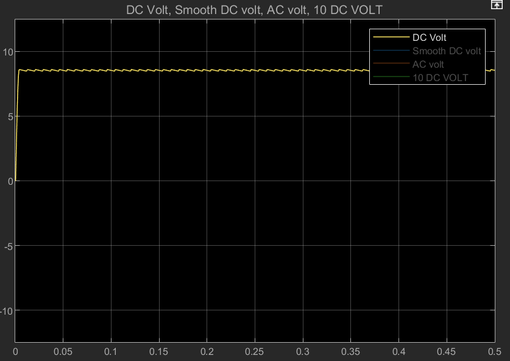

## AC-to-DC-Converter-Project
MATLAB Simulink Project: AC to DC Coverter with rectifier, non-inverting op-amp, RC low-pass filter for min. ripple.

## Introduction

This mini-project was undertaken to strengthen my understanding of electrical Simscape and circuit theory by analyzing circuit components and their interactions. The focus was on combined circuits and practicing concepts introduced in the Circuit Simulation Onramp, ultimately aiming to achieve AC-to-DC signal conversion.

## Purpose
The aim is to achieve ~=10 V DC with minimized ripple for stable supply applications.

## Circuit Diagram

## Project in Detail (How it works?, The logic explanation, Features,Components Used)

This project demonstrates the design of an AC to DC converter using:

- Transformer ==> I used a voltage transformer to represent voltage step down 220 V to 10 V.

- Full-wave rectifier ==> A full-wave rectifier bridge with four diodes, a resistor and a capacitor for converting.  
   Diodes' forward voltage : 0.7 V (voltage drop)  
   Resistor's resistance : I preferred 5 kOhm resistor, because load is more preferred between 1 kOhm- 10 kOhm in real life applications. Also I wanted to see the ripple more clearly on the signal.  
   Capacitans of the capacitor: I chose 100 uF (micro Farad). So time constant is 0.5 s from R*C. With τ = 0.5 s, the discharge is very slow compared to the 10 ms ripple period, hence good smoothing. Since in Türkiye, the mains AC frequency is 50 Hz, I chose AC voltage source's frequency as 50 Hz. In full-wave rectifier, frequency is doubled because it converts all positive and negative half-waves to positive. Thus, the capacitor recharges every 10 ms (50 * 2=100 Hz, 1/(100 Hz)= 0.01 s= 10 ms). Since 0.5 s ≫ 10 ms, the capacitor voltage remains nearly constant between charging cycles. This creates a strong smoothing effect but since resistance is not that great, some ripple still occurs.  
   Now, we have a DC signal but there are two problems. First one is, because of diode voltage drops output voltage is not 10 V ideally. In four diodes bridge, two diodes are active on the positive side of signals and other two are opened circut. Moreover, on the negative side, vice-versa. So, in both case we always have 0.7+0.7=1.4 V voltage drop. Therefore, 10-1.4=8.6 V for output voltage. But lets make it ~=10 V as we desired.
- A non-inverting Op-amp ==> To achieve a gain yielding approximately 10 V, I chose R2 = 7 kOhm and R1 = 43 kOhm for $Vout=Vin(1+(R2/R1))$. So, we now have 9.976 V that is almost 10 V DC signal. But the second problem is there is still ripple. We want to make the signal more smooth and clean. Furthermore, a low-pass filter would work to prevent high frequencies.
  
- RC low-pass filter ==> First of all, why did not I prefer a serie RL low-pass filter? Since I wanted to consider real life conditions, inductors are generally more expensive and larger than capacitors. Therefore, I preferred a design that is both cost-effective and space-saving.  
   Resistor of the filter: 10 kOhm  
   Capacitance of the filter capacitor: 10 uF     
   Cut-off Frequency = 1/(2 * pi * R*C) = 1.59 Hz    
==> After full-wave rectifier, AC ripple frequency is 100 Hz. A low-pass filter attenuates frequencies above its cutoff frequency and allows lower frequencies to pass with little attenuation. Therefore, the 0 Hz DC component of the voltage will remain entirely unattenuated. 1.59 Hz << 100 Hz

## Tools
- MATLAB Simulink
- Circuit Simulation Simscape
- Basic Circuit Theory

## Results  
- Full-wave rectifier: ~=8.6 V DC with ~=172 mV ripple ( V(ripple)= I/(2*f*C) ==> I = 8.6/5000 = 1.72 mA , 2*f*C = 2 * 50 * 100 uF = 0.01, V(ripple)  ~= 172 mV  ) 
- Op-amp used to restore voltage close to 10 V  (gain ~= 1.16 V, V(ripple,op) = 172*1.16 ~= 200 mV )
- RC filter further reduced ripple ==> V(ripple,final)= 200 mV*|H(f)|= 200*|H(100)| ~= 200*0.0116 ~= 3.18 mV and V(out) ~= 10 V a DC signal.  

Table of Results: 

  

10 V AC after transforming:

 

~8.6V DC after rectifying:

 

~10V DC after amplifying:

 

Smooth 10V DC signal as finally:

